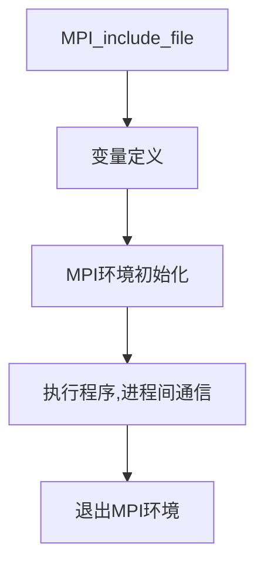

## MPI安装
OpenMPI下载地址：[Downloads | MPICH](https://www.mpich.org/downloads/)
下载后执行以下命令：
```shell
apt install gcc g++ gfortran
tar -xvf mpich.tar.gz
cd mpich
./configure --prefix=/usr/local/mpi
make -j 8
make install
```
配置环境变量：
```shell
vim ~/.bashrc
export PATH=/usr/local/mpi/bin:$PATH

source ~/.bashrc
which mpicc
```
## MPI基础
### 计算任务划分
计算任务分配两种方式：
- 任务并行：每个节点执行不同任务
- 数据并行：每个节点执行相同任务但数据不同
按照程序可以划分为：
- SPMD(单程序多数据)
- MPMD(多程序多数据)
### MPI任务执行流程



### MPI基本函数
#### MPI_Init
```c
int MPI_Init(&argc, &argv);
//任何MPI程序调用的第一个MPI函数都是该函数，它负责指示系统完成所有初始化工作
```
#### MPI_Initialized
```c
int MPI_Initialized(int* flag);
//唯一可在MPI_Init前使用的函数，用来检测MPI系统是否已经初始化，已经调用MPI_Init，返回flag=true，否则返回flag=false。
```
#### MPI_Comm_rank
```c
int MPI_Comm_rank(MPI_Comm comm, int* rank);
//comm为进程所在的通信域即进程所在的分组，rank为进程号
//比如存在[0,1,2,3]四个进程，[0,1]为一组，[2,3]为一组
```
#### MPI_Comm_size
```c
int MPI_Comm_size(MPI_Comm comm, int* size);
//进程通过调用函数MPI_Comm_size来确定一个通信域中的进程总数
```
#### MPI_Finalize
```c
int MPI_Finalize(void);
//进程执行完全部MPI函数后，调用该函数让系统释放分配给MPI的资源
//每个进程都必须调用该函数，调用该函数后不能调用任何MPI函数，若不执行退出函数，进行可能会被悬挂
```
#### MPI_Get_processor_name
```c
int MPI_Get_processor_name(char* name, int* resultlen);
//获取处理器名称，返回的name中存储所在处理器的名称，resultlen存放返回名字所占字节
```
#### MPI_Get_version
```c
int MPI_Get_version(int* version, int* subversion);
//获取MPI版本号，若版本号为4.2，则返回version=4，subversion=2
```
#### MPI_Wtime
```c
double MPI_Wtime(void);
//获取墙上时间，用浮点数表示秒数；经常用来计算程序运行时间
```
#### MPI_Send
```c
int MPI_Send(
	const void *buf,         //传递数据的起始地址
	int count,               //长度，首地址后count个变量
	MPI_Datatype datatype,   //变量类型，MPI预定义的变量类型
	int dest,                //接收的进程号
	int tag,                 //信息标识，发送和接收需要tag一致
	MPI_Comm comm            //进程所在的通信域
);
```
#### MPI_Recv
```c
int MPI_Recv(
	void *buf,      
	int count, 
	MPI_Datatype datatype, 
	int source, 
	int tag, 
	MPI_Comm comm, 
	MPI_Status *status
);
// MPI_Status 有三个域，通过status.MPI_SOURCE(所受到数据发送源的进程号),status.MPI_TAG(消息的tag),status.MPS_ERROR(错误代码)的方式调用三个信息
//MPI_Send和MPI_Recv需要成对出现，若两个进程存在互相发送消息，则需要注意调用顺序。
```